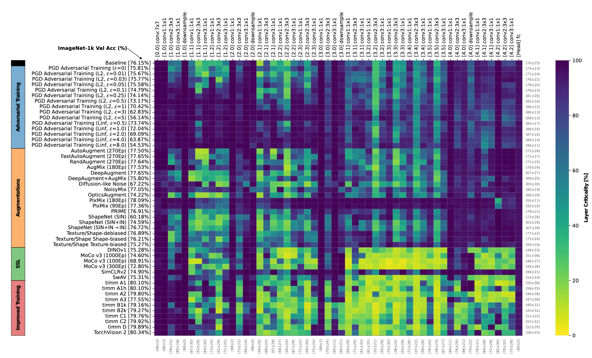

# How Do Training Methods Influence the Utilization of Vision Models?
Paul Gavrikov, Shashank Agnihotri, Margret Keuper, and Janis Keuper

[![CC BY-SA 4.0][cc-by-sa-shield]][cc-by-sa]

Presented at: NeurIPS 2024 IAI Workshop: Interpretable AI: Past, Present and Future

[ArXiv](https://arxiv.org/abs/2410.14470)<!-- | [Paper]() | [HQ Poster]() -->


Abstract: *Not all learnable parameters (e.g., weights) contribute equally to a neural network’s decision function. In fact, entire layers’ parameters can sometimes be reset to random values with little to no impact on the model’s decisions. We revisit earlier studies that examined how architecture and task complexity influence this phenomenon and ask: is this phenomenon also affected by how we train the model? We conducted experimental evaluations on a diverse set of ImageNet-1k classification models to explore this, keeping the architecture and training data constant but varying the training pipeline. Our findings reveal that the training method strongly influences which layers become critical to the decision function for a given task. For example, improved training regimes and self-supervised training increase the importance of early layers while significantly under-utilizing deeper layers. In contrast, methods such as adversarial training display an opposite trend. Our preliminary results extend previous findings, offering a more nuanced understanding of the inner mechanics of neural networks.*


[cc-by-sa]: http://creativecommons.org/licenses/by-sa/4.0/
[cc-by-sa-image]: https://licensebuttons.net/l/by-sa/4.0/88x31.png
[cc-by-sa-shield]: https://img.shields.io/badge/License-CC%20BY--SA%204.0-lightgrey.svg

<p align="center">
  
</p>

## Reproduce our results


### Repeating model evaluations
Our codebase supports parameter resets per individual model. The models are automatically fetched from timm, huggingface, Google Drive, or an URL depending on the model.

To evaluate an individual model you can run: 
```bash
python main.py --imagenet <PATH TO IMAGENET VAL> --model <MODEL ID> --output_patch <OUTPUT PATH>
```
The default parameters correspond to the methodology used in the paper. Once finished this will write all raw results torch file to the output path. The name of the generated file will correspond to the the current timestamp and model ID (e.g., 'resnet50_trained_on_SIN_and_IN').

<details>
<summary>A list of all model IDs we have analyzed</summary>
```python
['resnet50_augmix_180ep', 'resnet50.a2_in1k',
       'robust_resnet50_linf_eps1.0', 'resnet50_opticsaugment',
       'robust_resnet50_l2_eps0.25', 'resnet50.fastautoaugment_270ep',
       'resnet50_tsbias_sbias', 'resnet50_trained_on_SIN',
       'resnet50.a1_in1k', 'resnet50_moco_v3_100ep', 'resnet50.b1k_in1k',
       'resnet50.c2_in1k', 'resnet50.b2k_in1k', 'resnet50_dino',
       'resnet50_prime', 'robust_resnet50_l2_eps0.01',
       'resnet50.autoaugment_270ep', 'resnet50_pixmix_180ep',
       'resnet50_deepaugment', 'tv_resnet50', 'resnet50.a3_in1k',
       'robust_resnet50_l2_eps0.1', 'resnet50.a1h_in1k', 'tv2_resnet50',
       'resnet50_diffusionnoise_fixed_nonoise', 'resnet50_simclrv2',
       'resnet50_trained_on_SIN_and_IN', 'resnet50_moco_v3_1000ep',
       'robust_resnet50_l2_eps5', 'resnet50_tsbias_debiased',
       'resnet50_moco_v3_300ep', 'robust_resnet50_l2_eps0.03',
       'resnet50.randaugment_270ep', 'robust_resnet50_l2_eps1',
       'robust_resnet50_linf_eps2.0', 'robust_resnet50_l2_eps0.05',
       'resnet50.c1_in1k',
       'resnet50_trained_on_SIN_and_IN_then_finetuned_on_IN',
       'resnet50_swav', 'robust_resnet50_linf_eps8.0',
       'robust_resnet50_l2_eps0', 'resnet50_pixmix_90ep',
       'resnet50_noisymix', 'robust_resnet50_l2_eps3',
       'resnet50_tsbias_tbias', 'robust_resnet50_linf_eps4.0',
       'robust_resnet50_l2_eps0.5', 'robust_resnet50_linf_eps0.5',
       'resnet50_deepaugment_augmix', 'resnet50_frozen_random',
       'resnet50.d_in1k']
```
</details>


### Visualizing results
We recommend to create one summary csv from all pt files - please refer to the logic in <a href="./code/convert_pt_checkpoints_to_csv.py">code/convert_pt_checkpoints_to_csv.py</a>.
Our processed and aggregated can be found in <a href="./raw-results/results.csv">raw-results/results.csv</a>.
Please take a look at <a href="./code/analysis.ipynb">code/analysis.ipynb</a> to reproduce our plots.

## Citation 

If you find our work useful in your research, please consider citing:

```
@inproceedings{
    gavrikov2024how,
    title={How Do Training Methods Influence the Utilization of Vision Models?},
    author={Paul Gavrikov and Shashank Agnihotri and Margret Keuper and Janis Keuper},
    booktitle={NeurIPS 2024 Workshop on Interpretable AI: Past, Present and Future},
    year={2024},
    url={https://openreview.net/forum?id=zJFvjdW9JS}
}
```

The model zoo originates from <a href="https://github.com/paulgavrikov/biases_vs_generalization">Can Biases in ImageNet Models Explain Generalization?
 (CVPR 2024)</a>. Please additionally cite if you use it:

```
@inproceedings{
    gavrikov2024can,
    author={Gavrikov, Paul and Keuper, Janis},
    title={Can Biases in ImageNet Models Explain Generalization?},
    booktitle={Proceedings of the IEEE/CVF Conference on Computer Vision and Pattern Recognition (CVPR)},
    month={June},
    year={2024},
    pages={22184-22194}
}
```

### Legal
This work is licensed under a
[Creative Commons Attribution-ShareAlike 4.0 International License][cc-by-sa].
